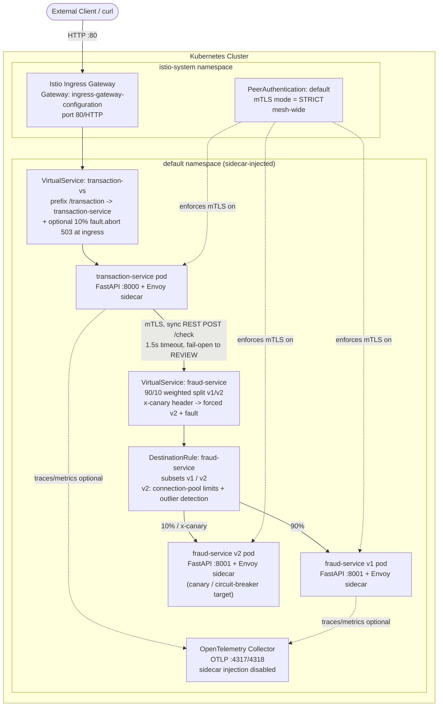

# Istio Service Mesh POC — Fintech Microservices


## Executive Summary

This repository is a **hands-on proof of concept for Istio service-mesh capabilities**, built around two small FastAPI microservices that stand in for a simplified payments flow: a `transaction-service` that receives payment requests, and a `fraud-service` that scores them for risk. The application logic itself is intentionally minimal — the point of the repo is what Istio does *around* the two services:

- **mutual TLS (mTLS)** enforced mesh-wide between sidecars,
- **ingress gateway routing** from outside the cluster to `transaction-service`,
- **traffic splitting / canary routing** between two versions of `fraud-service` via `DestinationRule` subsets and weighted `VirtualService` routes,
- **fault injection** (HTTP aborts and injected latency) at both the ingress and the internal service level, to observe how the mesh — and the calling service's own timeout/fail-open logic — behaves under failure, and
- **circuit breaking / outlier detection** on a `fraud-service` subset via connection-pool and ejection settings.

This is a **learning/demo project**, not a production payments system. There is no real fraud model, no persistence, and no authn/authz beyond mTLS. Treat it as a working reference for "how do these Istio primitives actually get wired together," not as a fintech reference architecture.

## Architecture



**Request flow:** a client calls the Istio ingress gateway on port 80. The `transaction-vs` `VirtualService` routes any `/transaction`-prefixed path to `transaction-service`. `transaction-service` synchronously calls `fraud-service` over its in-cluster DNS name (`http://fraud-service.default.svc.cluster.local/check`) with a hard 1.5s timeout; if the call fails or times out, it **fails open** and returns a `REVIEW` decision rather than blocking the transaction. Calls between sidecar-injected pods are encrypted via Istio-managed mTLS because of a mesh-wide `STRICT` `PeerAuthentication` policy. `fraud-service` itself has two versions (`v1`, `v2`) wired up as `DestinationRule` subsets, normally split 90/10 by the `fraud-service` `VirtualService`, with several experimental variants used to demonstrate fault injection (delayed responses, forced 500s) and, on the `v2` subset, connection-pool limits plus outlier detection (circuit breaking).

## Repository Layout

| Path | What it is | Authored by repo owner? |
|---|---|---|
| `Fintech-istio-poc/fraud-service/` | FastAPI fraud-scoring service, Dockerfile, Istio/K8s manifests | Yes — authored POC |
| `Fintech-istio-poc/transaction-service/` | FastAPI transaction-orchestration service, Dockerfile, K8s manifest | Yes — authored POC |
| `Fintech-istio-poc/test.sh`, `test2.sh`, `test-ingress.gateway.sh` | Load/scenario shell scripts used to exercise the mesh | Yes — authored POC |
| `Fintech-istio-poc/Kiali-svc.PNG` | Screenshot of the Kiali service graph during testing | Yes — authored POC |
| `istio-1.22.1/` | **Vendored copy of the upstream Istio 1.22.1 release** (`istioctl.exe`, `manifests/`, `samples/`, `tools/`, Istio's own `README.md`/`LICENSE`) downloaded from istio.io/GitHub releases | **No — third-party, unmodified upstream distribution.** See [Known Issues](#known-issues--recommendations). |

> **Do not attribute `istio-1.22.1/` to the repo owner.** It is the stock Istio 1.22.1 release archive (confirmed via its own `README.md`, which is Istio's standard project README, and its own Apache-2.0 `LICENSE`), included so the POC could be run locally (it bundles `istioctl.exe`). It is not modified project code.

## Tech Stack

- **Service mesh:** Istio 1.22.1 (Gateway, VirtualService, DestinationRule, PeerAuthentication)
- **Orchestration:** Kubernetes (manifests are NodePort-based, written against a local cluster — Docker Desktop Kubernetes / Minikube / kind)
- **Services:** Python 3.11, FastAPI, Uvicorn, Pydantic v2, `requests` (see each service's `requirements.txt`)
- **Containers:** Docker (`python:3.11-slim` base images)
- **Observability (optional/partial):** OpenTelemetry Collector manifest, Kiali (referenced via screenshot; not itself part of this repo)

## Prerequisites

- A local Kubernetes cluster with Istio installed (Docker Desktop Kubernetes, Minikube, or kind). The bundled `istio-1.22.1/bin/istioctl.exe` can be used to install Istio (`istioctl install`) if you don't already have it on your `PATH`.
- Docker, to build the two service images.
- `kubectl` configured against your cluster.
- Sidecar injection enabled on the target namespace (`kubectl label namespace default istio-injection=enabled`) — the manifests rely on Istio sidecars being present for mTLS, routing, and fault injection to take effect.
- `bash`/`curl` to run the test scripts (Git Bash or WSL on Windows).

## Quick Start

```bash
# 1. Build the two service images (adjust the tag/registry to your own)
cd Fintech-istio-poc/fraud-service
docker build -t <your-registry>/fraud-service:v1 .

cd ../transaction-service
docker build -t <your-registry>/transaction-service:v1 .

# 2. Push images and update the `image:` fields in the kubernetes/*.yaml manifests
#    (the checked-in manifests reference the original author's Docker Hub images,
#    e.g. shahid9741/fraud-service:v2 — replace with your own before applying)

# 3. Enable sidecar injection and deploy
kubectl label namespace default istio-injection=enabled
kubectl apply -f Fintech-istio-poc/fraud-service/kubernetes/deploy.yaml
kubectl apply -f Fintech-istio-poc/fraud-service/kubernetes/deploy-2.yaml
kubectl apply -f Fintech-istio-poc/fraud-service/kubernetes/destination-rules.yaml
kubectl apply -f Fintech-istio-poc/fraud-service/kubernetes/virtualservice.yaml
kubectl apply -f Fintech-istio-poc/transaction-service/kubernetes/deploy.yaml
kubectl apply -f Fintech-istio-poc/fraud-service/kubernetes/ingress-gateway.yaml

# 4. Enforce mesh-wide mTLS
kubectl apply -f Fintech-istio-poc/fraud-service/kubernetes/enforce-mtls-only.yaml

# 5. Reach the ingress gateway locally (see also
#    Fintech-istio-poc/fraud-service/kubernetes/ingress-gateway-readme-docker-desktop.readme.md)
kubectl port-forward svc/istio-ingressgateway -n istio-system 8080:80

# 6. Exercise the mesh
cd ../..
bash Fintech-istio-poc/test-ingress.gateway.sh
```

> The `kubernetes/` folders contain several **alternative/experimental** manifests for the same `VirtualService`/`DestinationRule` objects (e.g. `virtualservice-latency-v2.yaml`, `-v3.yaml`, `-v4 copy.yaml`, `virtualservice-error-injection-v5.yaml`, `destination-rules-circuitbreaking.yaml`). These were used one at a time, iteratively, to demonstrate different fault-injection and circuit-breaking scenarios — apply only one `VirtualService`/`DestinationRule` variant for `fraud-service` at a time, since they collide on the same object name.

## What the Test Scripts Actually Do

| Script | Target | Behavior |
|---|---|---|
| `Fintech-istio-poc/test.sh` | `transaction-service` directly (`localhost:8081`, e.g. via port-forward) | Fires up to 1,000,000 randomized POST `/transaction` requests (random user, amount) in a loop, printing `curl`'s total request time for each — a basic load/latency soak test. |
| `Fintech-istio-poc/test2.sh` | `transaction-service` via a specific NodePort (`172.19.30.208:30081`) | Same randomized load, but ~10% of requests add an `x-canary: true` header, intended to exercise canary routing/fault-injection rules on `fraud-service`. |
| `Fintech-istio-poc/test-ingress.gateway.sh` | Istio ingress gateway (`localhost:8080`, via `kubectl port-forward svc/istio-ingressgateway`) | Same randomized load with the same 10%-canary-header pattern, but routed through the ingress gateway and `transaction-vs` `VirtualService` rather than hitting the service directly. |

All three scripts are load-generation / manual-verification tools, not automated test suites (no assertions, no CI wiring, no exit-code checks) — verification is done by watching response codes/latency and cross-referencing with Kiali/`kubectl` observability during the run.

**Known gap:** `test2.sh` and `test-ingress.gateway.sh` send the `x-canary` header to `transaction-service`'s public `/transaction` endpoint, but `transaction-service`'s own outbound call to `fraud-service` (see `Fintech-istio-poc/transaction-service/app/main.py`) does **not** forward incoming request headers. Istio does not add this header on its own. So the header-based canary `VirtualService` rules on `fraud-service` (`x-canary: true` → forced `v2` + fault) are not actually reachable end-to-end through these scripts as currently written — they'd need to be sent directly against the `fraud-service` endpoint, or `transaction-service` would need to propagate the header, for that specific canary path to trigger.

### Kiali Screenshot

`Fintech-istio-poc/Kiali-svc.PNG` is a Kiali service-graph capture taken while running the test traffic above. It's useful as a quick visual sanity check of the mesh topology (ingress → `transaction-service` → `fraud-service` subsets) and traffic split during a live test run; it is not regenerated automatically and may not reflect the exact current manifest state.

## Security Considerations

- **mTLS is enforced mesh-wide** via `Fintech-istio-poc/fraud-service/kubernetes/enforce-mtls-only.yaml` — a `PeerAuthentication` named `default` in the `istio-system` (root) namespace with `mtls.mode: STRICT`. In Istio, a `PeerAuthentication` named `default` placed in the mesh's root namespace acts as the mesh-wide default, so this forces STRICT mTLS for all sidecar-injected workloads in the mesh unless overridden by a more specific namespace/workload-level policy (none exists in this repo).
- **No application-layer authn/authz.** Neither `fraud-service` nor `transaction-service` implements API keys, JWTs, or request signing — security here is entirely at the mesh transport layer (mTLS between sidecars). There is no `AuthorizationPolicy` in the repo restricting which services may call which.
- **No secrets found** in the application code or Kubernetes manifests during review (no hardcoded credentials, tokens, or keys). Environment-driven config (`FRAUD_SERVICE_URL`, `HTTP_TIMEOUT_SECONDS`) uses plain, non-sensitive values.
- **Fail-open behavior:** if `fraud-service` is unreachable or slow, `transaction-service` returns a `REVIEW` decision rather than blocking the transaction (see `main.py` comments — a deliberate business tradeoff, not a bug, but worth calling out since it means mesh-level faults directly influence a business decision).
- **NodePorts are fixed and unauthenticated** (`30080`, `30081`) — fine for a local POC, not something to expose beyond a local/dev cluster as-is.

## Troubleshooting

- **`curl: (7) Failed to connect` / connection refused on NodePort** — in Docker-based local clusters, NodePorts are often not reachable directly from the host. Use `kubectl port-forward` instead; see `Fintech-istio-poc/fraud-service/kubernetes/ingress-gateway-readme-docker-desktop.readme.md` for a full explanation of this specific Docker-Desktop-Kubernetes quirk.
- **503s from the ingress gateway** — check whether `ingress-gateway-fault-tolerance.yaml` (which injects a 10% synthetic 503 `fault.abort` at the ingress `VirtualService`) is currently applied; that's expected/intentional fault-injection, not a bug.
- **Requests to `fraud-service` failing / mTLS handshake errors** — confirm the target namespace has `istio-injection=enabled` and pods have been restarted after labeling (sidecars aren't retroactively injected into already-running pods). With `PeerAuthentication` set to STRICT, a workload without a sidecar cannot talk to one that has it.
- **Two `fraud-service` `VirtualService`/`DestinationRule` objects conflicting** — only one variant of each experimental manifest (`virtualservice*.yaml`, `destination-rules*.yaml`) should be applied at a time; they all define an object of the same `metadata.name`, so re-applying "overwrites" the previous behavior.
- **`istioctl` not found** — use the vendored binary at `istio-1.22.1/bin/istioctl.exe`, or install your own copy per [istio.io](https://istio.io/latest/docs/setup/getting-started/).

## Status & Roadmap

**Working / demonstrated:**
- Ingress gateway routing to `transaction-service`
- Service-to-service call with mesh-enforced mTLS
- Weighted traffic splitting and canary-style routing on `fraud-service`
- Fault injection (delay, abort) at both ingress and service level
- Circuit breaking / outlier detection config on a `fraud-service` subset

**Real gaps / not yet done:**
- No automated tests or CI (the shell scripts are manual load-generation tools, not a test suite with assertions)
- No `AuthorizationPolicy` — mTLS provides transport security only, not service-to-service authorization
- Header-based canary routing (`x-canary`) is not actually exercised end-to-end by the provided test scripts (see [Known Gap](#what-the-test-scripts-actually-do) above)
- Several near-duplicate experimental manifests (`virtualservice-latency-v2/v3/v4 copy.yaml`, `virtualservice-error-injection-v5.yaml`) were never consolidated into a single, clearly-versioned demo flow — useful for learning history but should eventually be pruned/organized (e.g. into a `kubernetes/experiments/` subfolder) if this repo continues to evolve
- No resource requests/limits, liveness/readiness probes, or HPA on either service's `Deployment`
- No Helm chart / kustomize overlay — all manifests are applied ad hoc with `kubectl apply -f`

## Known Issues / Recommendations

1. **Vendored Istio release checked into git (top priority).** `istio-1.22.1/` is the full, unmodified upstream Istio 1.22.1 release distribution (~534 MB on disk), including a **94 MB compiled `istioctl.exe` binary**, sample manifests, and tooling — all committed directly into this repository's git history. This is a repo-hygiene problem for several reasons: it bloats every clone/fetch, defeats the purpose of git for large binaries, mixes third-party release artifacts with authored source in the same history, and will only get worse if the vendored version is ever upgraded (each version adds another full copy in history). **Recommended fix (not applied — this requires a decision and a history rewrite the owner should do deliberately):**
   - Remove `istio-1.22.1/` from version control going forward and instead document "download Istio from [istio.io](https://istio.io/latest/docs/setup/getting-started/) or the [GitHub releases page](https://github.com/istio/istio/releases)" in this README, **or**
   - If a pinned local copy is genuinely needed for reproducibility, track only the binary via **Git LFS** (or a `.gitattributes` filter) rather than plain git, **or**
   - At minimum, `.gitignore` it going forward so it stops growing, and consider a history-rewrite (`git filter-repo`/BFG) to shrink the existing repository — this is a destructive operation and was intentionally **not** performed as part of this documentation pass.
2. **Experimental manifest sprawl.** Multiple near-duplicate `VirtualService`/`DestinationRule` YAML files for `fraud-service` exist side by side with only their fault-injection parameters differing. They work as a "history of what was tried," but are easy to accidentally re-apply out of order. Consider consolidating into a single manifest with commented-out variants, or an `experiments/` subfolder with a short note on what each demonstrates.
3. **No LICENSE previously existed** for the authored POC content — added at the repo root (`LICENSE`, MIT) in this pass. Note this covers only the `Fintech-istio-poc/` authored code; the vendored `istio-1.22.1/` distribution keeps its own upstream Apache-2.0 license, unmodified, at `istio-1.22.1/LICENSE`.
4. **No `.gitignore`** previously existed; a baseline one has been added in this pass (Python artifacts, editor/OS files, env files) to reduce future accidental commits.
5. **`ingress-gateway-fault-tolerance.yaml` and `ingress-gateway.yaml` both define a `Gateway`/`VirtualService` pair named `ingress-gateway-configuration`/`transaction-vs`** with different behavior (one adds a 10% fault-abort, one doesn't) — same "only apply one at a time" caveat as the `fraud-service` experimental manifests.

## License

The authored content of this repository (`Fintech-istio-poc/`) is licensed under the [MIT License](LICENSE). The vendored `istio-1.22.1/` directory is the unmodified upstream Istio project and remains under its own [Apache License 2.0](istio-1.22.1/LICENSE) — see that directory for details.
